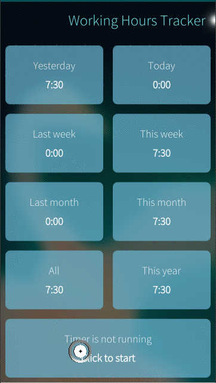

# Working Hours Tracker

[![Sponsored](https://img.shields.io/badge/chilicorn-sponsored-brightgreen.svg?logo=data%3Aimage%2Fpng%3Bbase64%2CiVBORw0KGgoAAAANSUhEUgAAAA4AAAAPCAMAAADjyg5GAAABqlBMVEUAAAAzmTM3pEn%2FSTGhVSY4ZD43STdOXk5lSGAyhz41iz8xkz2HUCWFFhTFFRUzZDvbIB00Zzoyfj9zlHY0ZzmMfY0ydT0zjj92l3qjeR3dNSkoZp4ykEAzjT8ylUBlgj0yiT0ymECkwKjWqAyjuqcghpUykD%2BUQCKoQyAHb%2BgylkAyl0EynkEzmkA0mUA3mj86oUg7oUo8n0k%2FS%2Bw%2Fo0xBnE5BpU9Br0ZKo1ZLmFZOjEhesGljuzllqW50tH14aS14qm17mX9%2Bx4GAgUCEx02JySqOvpSXvI%2BYvp2orqmpzeGrQh%2Bsr6yssa2ttK6v0bKxMBy01bm4zLu5yry7yb29x77BzMPCxsLEzMXFxsXGx8fI3PLJ08vKysrKy8rL2s3MzczOH8LR0dHW19bX19fZ2dna2trc3Nzd3d3d3t3f39%2FgtZTg4ODi4uLj4%2BPlGxLl5eXm5ubnRzPn5%2Bfo6Ojp6enqfmzq6urr6%2Bvt7e3t7u3uDwvugwbu7u7v6Obv8fDz8%2FP09PT2igP29vb4%2BPj6y376%2Bu%2F7%2Bfv9%2Ff39%2Fv3%2BkAH%2FAwf%2FtwD%2F9wCyh1KfAAAAKXRSTlMABQ4VGykqLjVCTVNgdXuHj5Kaq62vt77ExNPX2%2Bju8vX6%2Bvr7%2FP7%2B%2FiiUMfUAAADTSURBVAjXBcFRTsIwHAfgX%2FtvOyjdYDUsRkFjTIwkPvjiOTyX9%2FAIJt7BF570BopEdHOOstHS%2BX0s439RGwnfuB5gSFOZAgDqjQOBivtGkCc7j%2B2e8XNzefWSu%2BsZUD1QfoTq0y6mZsUSvIkRoGYnHu6Yc63pDCjiSNE2kYLdCUAWVmK4zsxzO%2BQQFxNs5b479NHXopkbWX9U3PAwWAVSY%2FpZf1udQ7rfUpQ1CzurDPpwo16Ff2cMWjuFHX9qCV0Y0Ok4Jvh63IABUNnktl%2B6sgP%2BARIxSrT%2FMhLlAAAAAElFTkSuQmCC)](http://spiceprogram.org/oss-sponsorship)

An easy to use and simple Working Hours Tracker for SailfishOS

- v. 1.3.7-1 (for phone and tablet) available in Jolla store (12.02.2018) 
- Newest version available in [openrepos](https://openrepos.net/content/olpe/working-hours-tracker)
- Newest version also available with direct download [here](https://github.com/olpeh/wht/releases)

## Quick links

[Project page](https://wht.olpe.fi/) 
[Changelog](https://github.com/olpeh/wht/blob/master/qml/CHANGELOG.md) 
[License](https://github.com/olpeh/wht/blob/master/LICENSE.md) 
[Roadmap](https://github.com/olpeh/wht/projects/1) 
[Development](#development)

## Donate

Donations are welcome :) 

Paypal [EUR](https://www.paypal.com/cgi-bin/webscr?cmd=_donations&business=9HY294XX4EJFW&lc=FI&item_name=Olpe&item_number=Working%20Hours%20Tracker¤cy_code=EUR&bn=PP%2dDonationsBF%3abtn_donateCC_LG%2egif%3aNonHosted) 
Paypal [USD](https://www.paypal.com/cgi-bin/webscr?cmd=_donations&business=9HY294XX4EJFW&lc=FI&item_name=Olpe&item_number=Working%20Hours%20Tracker¤cy_code=USD&bn=PP%2dDonationsBF%3abtn_donateCC_LG%2egif%3aNonHosted)

## Translate

Working Hours Tracker project is in transifex. Please contribute to translations there:

https://www.transifex.com/projects/p/working-hours-tracker/

### Updating resources in transifex

The file `.tx/config` contains the basic config for what needs to be pushed to tx.

`~/.transifexrc`, which stores your Transifex credentials in your home directory. You shouldn’t share this file since it contains your own credentials.

To push a source file, use the -s or --source flag with the push command:

`$ tx push -s`

To pull translations from Transifex, run the following command:

`$ tx pull -a`

## License

[See license here](https://github.com/olpeh/wht/blob/master/LICENSE.md)

## Development

### Testing

WIP

### Releasing

Notes to myself on how to release a new version. This should be automated somehow.

- Verify that changes work correctly on all device types
- Push related changes to master
- Build both ARM and x86 versions in QT Creator
- Update `harbour-workinghourstracker.yml` with correct version and build numbers
- Update `CHANGELOG.md` with related changes
- Update `harbour-workinghourstracker.changes` with related changes
- Pull newest translations from Transifex `$ tx pull -a`
- Commit these changes with commmit message: `Release v.X.Y.Z-b`
- Push changes to master
- Create tag `X.Y.Z-b`
- Push tag to origin
- Create a new release in GitHub with new binaries as attachments
- Release new binaries in openrepos
- Optionally send new release to Jolla store QA
- Make sure Github issues and `Roadmap` project are up to date
